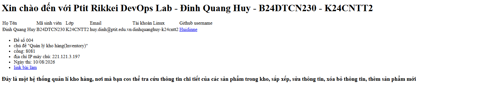

#DevOps Hackathon - Đề 004: Quản lý kho hàng(Inventory)

## 1. Thông tin sinh viên
| Họ và tên      | MSSV       | Lớp      | Tài khoản Linux       | GitHub   | Cổng Nginx |
|----------------|------------|----------|-----------------------|----------|------------|
| Đinh Quang Huy | B24DTCN230 | K24CNTT2 | dinhquanghuy-k24cntt2 | Huidinne | 8081       |

## 2. Môi trường triển khai
- hệ điều hành: Ubuntu 22.04
- phiên bản Nginx: 1.18.0
- Git: 2.25.1
- nơi chạy: VPS IP 221.121.3.197

## 3. Cấu trúc dự án
Cây thư mục
devops-hackathon-de004-dinhquanghuy/
├── src/
│   └── index.html
├── nginx
    └── dinhquanghuy-k24cntt2.conf
│
├── screenshots/
├── .gitignore
└── README.md

## 4. Cấu hình Nginx
```nginx
server {
    listen 80;
    listen [::]:80;

    server_name _;

    root /var/www/html;
    index index.html;

    location / {
        try_files $uri $uri/ =404;
    }

    location /api/ {
        proxy_pass http://127.0.0.1:8082/;

        proxy_set_header Host $host;
        proxy_set_header X-Real-IP $remote_addr;
        proxy_set_header X-Forwarded-For $proxy_add_x_forwarded_for;
        proxy_set_header X-Forwarded-Proto $scheme;
    }
}
```
## 5. Tường UFW
## 6. Các Bước triển khai
1. kết nối với VPS 
2. Tạo tài khoản Linux và cài đặt Nginx, Git, ...
3. Tạo trang index.html
4. Cấu hình github, đẩy mã nguồn lên github
5. Cấu hình UFW, triển khai website vói nginx

## 7. Hình ảnh website


## 8. Quy trình cập nhật website
1. Cập nhật mã nguồn trên máy local
2. Commit và push lên github
3. Trên VPS, pull mã nguồn mới từ github
4. Reload lại Nginx để áp dụng thay đổi
5. Kiểm tra website trên trình duyệt để đảm bảo các thay đổi đã được áp dụng thành công